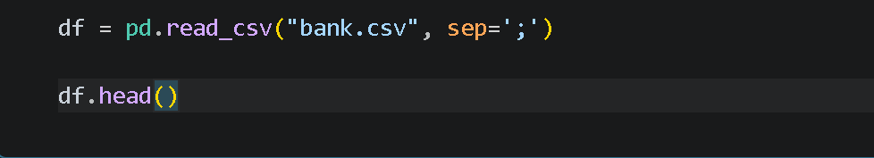
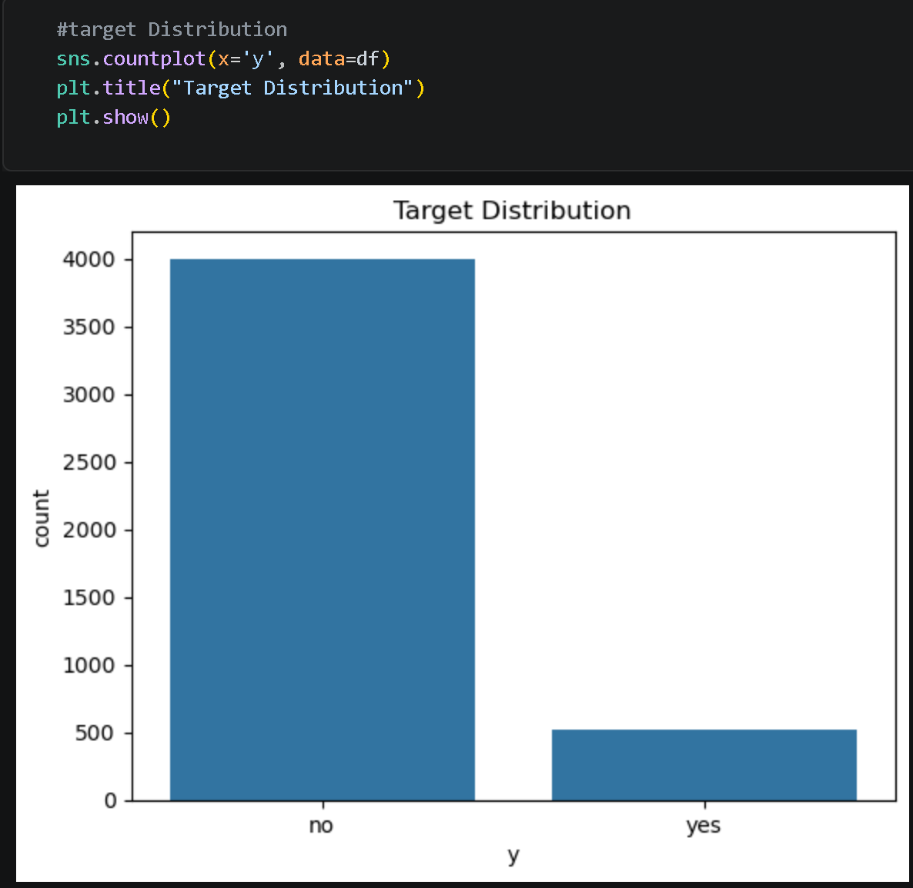
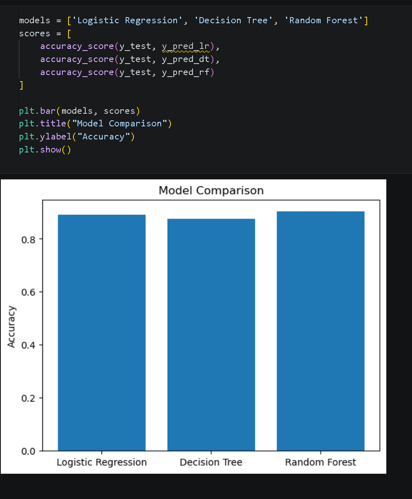
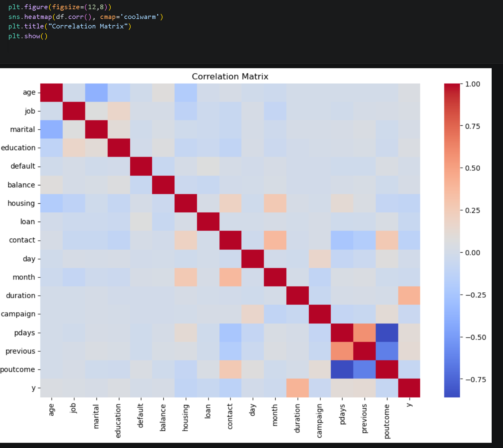

# Marketing Funnel & Conversion Analysis (Bank Marketing Dataset)

## Project Overview
This project analyzes customer conversion behavior using a real-world marketing dataset from a bank’s direct marketing campaigns.

The goal is to:
- Understand conversion patterns
- Predict customer subscription behavior
- Identify key factors influencing conversions
- Provide actionable recommendations to improve marketing performance

---

## Dataset
- Source: UCI Bank Marketing Dataset
- Description:
  The dataset contains information about clients contacted through marketing campaigns and whether they subscribed to a term deposit (target variable: `y`).

---

## Problem Statement
Businesses need to understand:
- Which customers are likely to convert
- What factors influence conversion decisions
- How to optimize marketing strategies

This project uses data analysis and machine learning to answer these questions.

---

## Tools & Technologies
- Python
- Pandas & NumPy (Data Processing)
- Matplotlib & Seaborn (Visualization)
- Scikit-learn (Machine Learning)

---

## Project Workflow

1. Data Loading  
2. Data Exploration (EDA)  
3. Data Cleaning & Transformation  
4. Feature Encoding  
5. Model Building  
6. Model Evaluation  
7. Insights & Recommendations  

---

## Target Variable
- `y = yes` → Customer converted  
- `y = no` → Customer did not convert  

---

## 📸 Key Visualizations

### Data Preview

### Target Distribution

### Model Comparison

### Feature Importance

### Correlation Heatmap

---

## Model Performance

| Model               | Description |
|--------------------|------------|
| Logistic Regression | Baseline model for classification |
| Decision Tree       | Captures non-linear relationships |
| Random Forest       | Best-performing model (ensemble) |

---

## Key Insights

- A large portion of customers do not convert, indicating a low overall conversion rate  
- Certain features (like contact duration, campaign frequency) strongly influence conversion  
- Random Forest model performs better than simpler models, capturing complex patterns  
- Customer behavior is influenced by multiple demographic and campaign-related factors  

---

## Funnel Interpretation

Even though this is a classification dataset, we interpret the funnel as:

